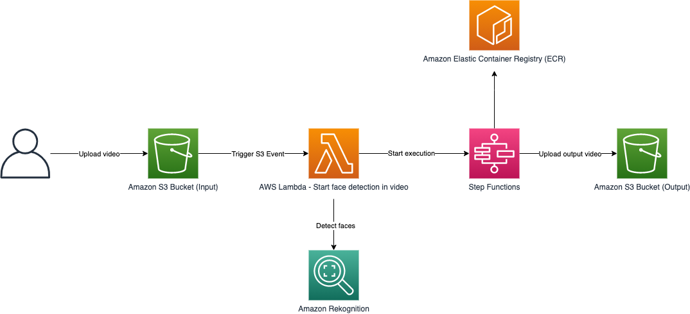
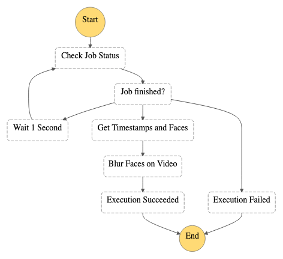
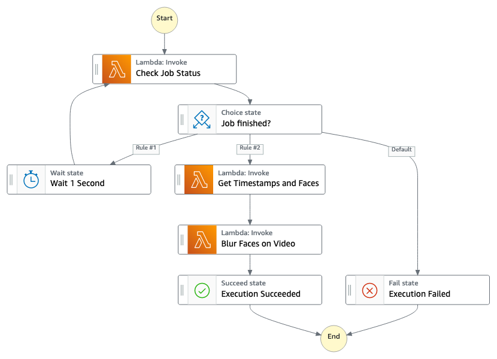

# rekognition-video-face-blur-cdk-app

## About

This code sample demonstrates how AWS Step Functions can be used to orchestrate AWS Lambda functions that call Amazon Rekognition for face detections, and use OpenCV to blur these detections per frame in the video. Customers can use Amazon Rekognition to enforce privacy/anonymity in videos.

Original video frame             |  Blurred video image
:-------------------------:|:-------------------------:
  |  

### Architecture

This code sample demonstrates how AWS Step Functions can be used to orchestrate AWS Lambda functions that call Amazon Rekognition for face detections, and use OpenCV to blur these detections per frame in the video.



### Container image support in AWS Lambda
Providing your serverless functions access to OpenCV is easier than ever with [Container Image Support](https://aws.amazon.com/blogs/aws/new-for-aws-lambda-container-image-support/). Instead of uploading a code package to AWS Lambda, your function's code instead resides in a Docker image that is hosted in [Amazon Elastic Container Registry](https://aws.amazon.com/ecr/).

```dockerfile
FROM public.ecr.aws/lambda/python:3.7
# Install the function's dependencies
# Copy file requirements.txt from your project folder and install
# the requirements in the app directory.
COPY requirements.txt  .
RUN  pip install -r requirements.txt
# Copy helper functions
COPY video_processor.py video_processor.py
# Copy handler function (from the local app directory)
COPY  app.py  .
# Overwrite the command by providing a different command directly in the template.
CMD ["app.lambda_function"]
```

### Project structure

This project contains source code and supporting files for a serverless application that you can deploy with the AWS CDK. It includes the following files and folders.

- rekognition_video_face_blurring_cdk/ - CDK python code for deploying the application
- rekopoc-apply-faces-to-video-docker/ - Code for Lambda function: uses OpenCV to blur faces per frame in video, uploads final result to output S3 bucket.
- rekopoc-check-status/ - Code for Lambda function: Gets face detection results for the Amazon Rekognition Video analysis.
- rekopoc-get-timestamps-faces/ - Code for Lambda function: Gets bounding boxes of detected faces and associated timestamps.
- rekopoc-start-face-detect/ - Code for Lambda function: is triggered by a S3 event when a new .mp4 or .mov video file is uploaded, starts asynchronous detection of faces in a stored video and starts the execution of AWS Step Functions' State Machine. 
- requirements.txt - Required packages for deploying the AWS CDK application

The application uses several AWS resources, including AWS Step Functions, Lambda functions and S3 buckets. These resources are defined in the `rekognition_video_face_blurring_cdk_stack.py` that resides inside the rekognition_video_face_blurring_cdk folder in this project. You can update the python code to add AWS resources through the same deployment process that updates your application code.
### AWS Step Functions workflow
AWS Step Functions is a low-code visual workflow service used to orchestrate AWS services, automate business processes, and build serverless applications. 
In this code sample, AWS Step Functions is used to orchestrate the calls and manage the flow of data between AWS Lambda functions. The AWS Step Functions workflow for this application consists of AWS Lambda functions SFN states as well as Choice, Wait, Fail and Succeed SFN states.

AWS Step Functions Workflow |  AWS Step Functions (SFN) States
:-------------------------:|:-------------------------:
 |  

## Deploy the sample application

### Deploy the AWS CDK application
The AWS Cloud Development Kit (AWS CDK) is an open source software development framework to define your cloud application resources using familiar programming languages. This project uses the AWS CDK in Python.  

* AWS CDK - [Getting started with the AWS CDK](https://docs.aws.amazon.com/cdk/latest/guide/getting_started.html)
* AWS CDK on GitHub - [AWS CDK on Github - Contribute!](https://github.com/aws/aws-cdk) 
* AWS CDK API Reference (for Python) - [AWS CDK Python API Reference](https://docs.aws.amazon.com/cdk/api/latest/python/modules.html)
* Docker - [Install Docker community edition](https://hub.docker.com/search/?type=edition&offering=community)

To build and deploy your application for the first time, ensure you have Docker running and have configured your AWS's credentials. 
The easiest way to satisfy this requirement is to issue the following command 
```bash
aws configure
```
After you have finished with these steps, run the following in your shell:

```bash
npm install -g aws-cdk
pip install -r requirements.txt
cdk bootstrap
cdk deploy
```

- The first command will install the AWS CDK Toolkit globally using Node Package Manager.
- The second command will install all the python packages needed by the AWS CDK using pip package manager.
- The third command will provision initial resources that the AWS CDK needs to perform the deployment. 
These resources include an Amazon S3 bucket for storing files and IAM roles that grant permissions needed to perform deployments.
- Finally, `cdk deploy` will deploy the stack.


### Cleanup

To delete the sample application that you created, use the AWS CDK. 
```bash
cdk destroy
```

## Resources

See the [Getting started with the AWS CDK](https://docs.aws.amazon.com/cdk/latest/guide/getting_started.html) for an introduction to important AWS CDK concepts and description of how to install and configure the AWS CDK.

Next, you can browse the AWS Samples/AWS CDK repository on GitHub. These examples each provide a demonstration of a common service implementation, or infrastructure pattern that could be useful in your use of the CDK for building your own infrastructure: [AWS CDK Examples](https://github.com/aws-samples/aws-cdk-examples)

## Credits

* Adrian Rosebrock, Blur and anonymize faces with OpenCV and Python, PyImageSearch,
    https://www.pyimagesearch.com/2020/04/06/blur-and-anonymize-faces-with-opencv-and-python/,
    accessed on 3 August 2021
* Jon Slominski, <a href=https://github.com/aws-samples/rekognition-face-blur-sam-app>aws-samples/rekognition-face-blur-sam-app</a>, accessed on 3 August 2021
* Video by <a href="https://www.pexels.com/@pixabay?utm_content=attributionCopyText&utm_medium=referral&utm_source=pexels">Pixabay</a> from <a href="https://www.pexels.com/video/video-of-people-walking-855564/?utm_content=attributionCopyText&utm_medium=referral&utm_source=pexels">Pexels</a>

## Security

See [CONTRIBUTING](CONTRIBUTING.md#security-issue-notifications) for more information.

## License

This library is licensed under the MIT-0 License. See the LICENSE file.

