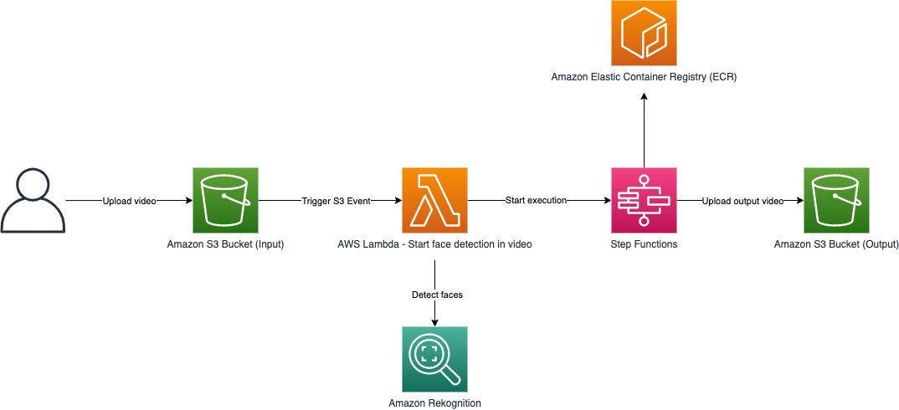
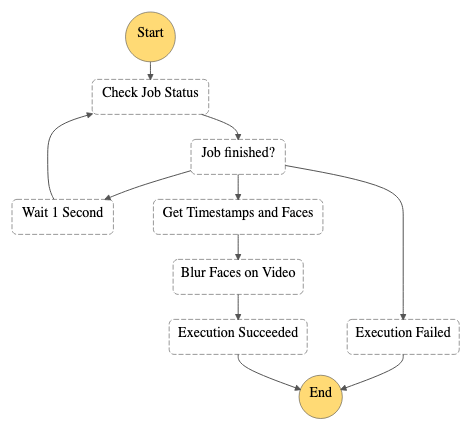
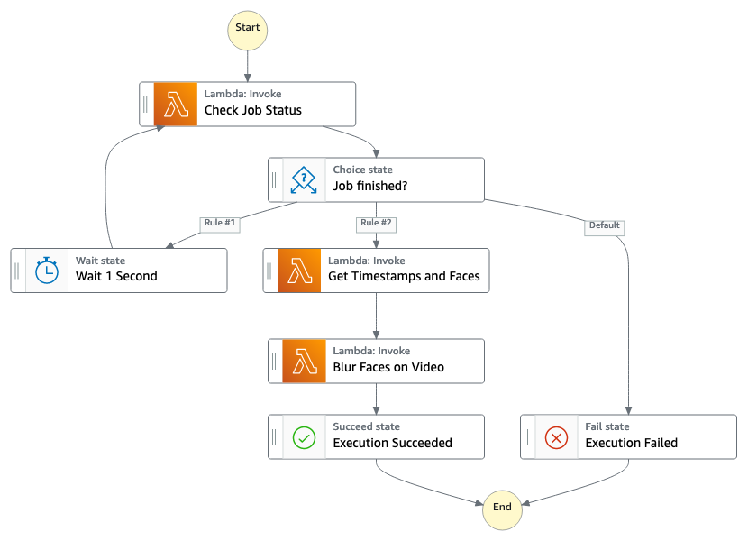

# Blur people faces in videos using Amazon Rekognition Video

This sample uses Amazon Rekognition Video to detect faces, AWS Step Functions to
coordinate processing, and OpenCV to pixelate detected faces. A Python 3.14 Lambda
container encodes the result as H.264 with optional AAC audio and saves it to S3.

Original video | Blurred video
:---:|:---:
 | 

## Architecture



1. Upload a video with a lowercase `.mp4` or `.mov` extension to the input bucket.
2. An S3 notification starts face detection and a Standard Step Functions execution
   for each object. Duplicate notifications reuse the detection job and execution.
3. The workflow polls Rekognition every five seconds until it succeeds or fails.
4. The results Lambda collects all result pages and writes bounding boxes and
   video metadata to a private S3 bucket. Step Functions passes only the object
   reference, avoiding its 256 KiB payload limit. Results expire after seven days.
5. The container downloads the source and detections, clips bounding boxes to the
   frame edges, pixelates faces, and encodes the video with its original audio when
   present. The output bucket receives the video under the **same object key**.
   Errors fail the workflow; incomplete processing is not reported as success.

The original diagram shows the main processing flow; the detection-results bucket
is an additional intermediate store. All three buckets block public access, use
S3-managed encryption, and require TLS. Lambda S3 permissions are scoped to their
input, output, or intermediate roles.

Workflow | States
:---:|:---:
 | 

## Prerequisites

- Python **3.14** (the deployment tools, tests, and application Lambdas use it).
- Node.js **22 or 24 LTS** and npm. CI uses Node.js 24.
- Docker with a running daemon and support for `linux/amd64` builds. The image
  platform is explicit so Apple Silicon builds match Lambda's x86_64 architecture.
- [AWS CLI v2](https://docs.aws.amazon.com/cli/latest/userguide/getting-started-install.html),
  installed separately, and an AWS account/Region supporting Rekognition Video.
- AWS credentials with permission to bootstrap/deploy CDK resources and use the
  sample. Deployment and video processing incur AWS charges.

The CDK library is pinned to **2.270.0** and the CLI to **2.1142.0**. Their version
numbers are independent. The old AWS CLI v1/PyYAML dependency chain is no longer
part of the Python environment.

## Install and deploy

From the repository root:

```bash
python3.14 -m venv .venv
source .venv/bin/activate
python -m pip install --require-hashes -r requirements.txt
npm ci --ignore-scripts

# Configure credentials, for example with AWS IAM Identity Center:
aws configure sso
aws sso login

npx cdk bootstrap
npx cdk synth
npx cdk diff
npx cdk deploy --outputs-file cdk.out/outputs.json
```

Use `AWS_PROFILE` and `AWS_REGION` if needed for your account. Keep the virtual
environment active when running CDK. The three small ZIP Lambdas use the AWS SDK
provided by the managed Python runtime; the container installs its own locked SDK.
No global CDK installation is needed.

Deployment reports `InputBucketName`, `OutputBucketName`, and `StateMachineArn`:

```bash
aws s3 cp ./example.mp4 s3://INPUT_BUCKET_NAME/examples/example.mp4
aws stepfunctions list-executions --state-machine-arn STATE_MACHINE_ARN --max-results 10
# After the execution succeeds:
aws s3 cp s3://OUTPUT_BUCKET_NAME/examples/example.mp4 ./blurred-example.mp4
```

Use the values from the stack outputs in place of the uppercase placeholders.
Input notifications are case sensitive: `.MP4` and `.MOV` do not trigger them.
Use a unique key per input and do not overwrite it until processing completes.
Re-uploading an object produces a new S3 sequencer and starts a new execution;
redelivering the same notification does not rerun a completed execution.

### Updating an existing deployment

The stack name and existing resource construct IDs are preserved, including the
input/output buckets, four application functions, and state machine. This update
adds a detection-results bucket, TLS bucket policies, and stack outputs. It
upgrades runtimes in place and increases processing scratch space and timeouts.
Run `npx cdk diff` against your environment before deploying, especially if you
have customized this sample. Allow active executions to finish before upgrading;
the blur handler also accepts the older inline detection payload format.

Container base tags receive AWS patches, but deployed images do not update
automatically. Rebuild and redeploy container assets when the base image changes;
CDK reuses unchanged asset hashes, so also update the Dockerfile's base image tag
or digest (or another asset file) to publish the rebuilt image.

## Limits and behavior

- Rekognition accepts supported MP4/MOV videos smaller than 10 GiB. This is an
  API ceiling, **not** this sample's practical video-size limit. The source,
  MJPEG intermediate, and encoded output must fit together in Lambda's 10 GiB
  temporary storage, and processing must finish within 15 minutes. The workflow
  has a one-hour deadline. Start with short clips; use batch/container compute for
  longer or higher-resolution videos.
- The sample retains the original half-second forward window for each detection.
  Fractional constant frame rates are preserved. Normalize variable-frame-rate
  videos before using this frame-index-based sample. A mismatch between decoded
  dimensions and Rekognition metadata fails processing rather than applying
  bounding boxes to the wrong pixels.
- Output video is H.264 with AAC audio if the source has audio. Silent input stays
  silent. The output container follows the input extension. Odd frame dimensions
  are padded to even dimensions for H.264 compatibility. Subtitles, chapters,
  metadata tracks, and original codecs are not preserved.
- Pixelation depends on Rekognition's detections. It cannot guarantee that every
  face is found or that a person cannot be identified. Review results before using
  them for privacy-sensitive purposes.
- Failed asynchronous S3 invocations use Lambda's retry behavior. Check CloudWatch
  logs and Step Functions execution history for failures; add alarms and failure
  destinations appropriate to your deployment.

## Development and verification

```bash
source .venv/bin/activate
python -m pip install --require-hashes -r requirements-dev.txt
python -m pip check
ruff check .
ruff format --check .
pytest -q
npm run synth -- --quiet
pip-audit --strict --disable-pip --no-deps -r requirements.txt -r stack/lambdas/rekopoc-apply-faces-to-video-docker/requirements.txt
npm audit --audit-level=low

docker build --pull --platform linux/amd64 -t face-blur:test stack/lambdas/rekopoc-apply-faces-to-video-docker
docker run --rm --read-only --tmpfs /tmp:rw,exec,size=1g --user 1000:1000 \
  --network none --cap-drop ALL --entrypoint python \
  -v "$PWD/scripts:/validation:ro" face-blur:test /validation/smoke_test_container.py
```

The smoke test runs the actual Lambda handler with generated MP4/MOV videos,
with and without audio. It checks pixelation, frame count, fractional frame rate,
H.264/AAC encoding, output keys, and temporary-file cleanup. Only S3 is replaced
with local files. Unit tests cover boundary faces, pagination, duplicate events,
batched events, processing failures, payload size, and synthesized infrastructure.
These tests require no AWS credentials or deployment. CI runs these checks on PRs
and on `main`; it does not deploy AWS resources.

Direct dependencies live in `requirements.in` files; `requirements.txt` files
include transitive pins and hashes. After editing a direct pin, regenerate all
three locks with [uv](https://docs.astral.sh/uv/) and rerun CI:

```bash
uv pip compile --upgrade --python .venv/bin/python --generate-hashes requirements.in -o requirements.txt
uv pip compile --upgrade --python .venv/bin/python --generate-hashes stack/lambdas/rekopoc-apply-faces-to-video-docker/requirements.in -o stack/lambdas/rekopoc-apply-faces-to-video-docker/requirements.txt
uv pip compile --upgrade --python .venv/bin/python --generate-hashes requirements-dev.in -o requirements-dev.txt
```

Dependabot checks Python, npm, container, and GitHub Actions dependencies weekly.
Check generated locks when reviewing its updates. GitHub Actions are pinned by
commit SHA. See [PLAN.md](PLAN.md) for the modernization priorities.

## Project structure

- `app.py`, `cdk.json`, `stack/rekognition_video_face_blurring_cdk_stack.py`: CDK app.
- `stack/lambdas/rekopoc-start-face-detect/`: S3 notification handler and job start.
- `stack/lambdas/rekopoc-check-status/`: Rekognition status polling.
- `stack/lambdas/rekopoc-get-timestamps-faces/`: Paginated results and S3 handoff.
- `stack/lambdas/rekopoc-apply-faces-to-video-docker/`: Python 3.14 container,
  OpenCV pixelation, and FFmpeg encoding. MoviePy is no longer required.
- `tests/`, `scripts/smoke_test_container.py`, `.github/workflows/ci.yml`: Validation.
- `requirements*.in`, `requirements*.txt`, `package-lock.json`: Dependency inputs and locks.

## Cleanup

```bash
npx cdk destroy
```

Buckets are retained to protect source and output videos. After stack deletion,
review and explicitly empty/delete the input, output, and detection-results
buckets if you no longer need them. Detection objects expire after seven days,
but the bucket remains. Review retained CloudWatch logs and CDK bootstrap/ECR
assets separately; bootstrap resources may be shared with other stacks.

## Resources and credits

- [AWS CDK getting started](https://docs.aws.amazon.com/cdk/v2/guide/getting-started.html)
- [Lambda Python container images](https://docs.aws.amazon.com/lambda/latest/dg/python-image.html)
- [Lambda supported runtimes](https://docs.aws.amazon.com/lambda/latest/dg/lambda-runtimes.html)
- [AWS CDK examples](https://github.com/aws-samples/aws-cdk-examples)
- Adrian Rosebrock, [Blur and anonymize faces with OpenCV and Python](https://pyimagesearch.com/2020/04/06/blur-and-anonymize-faces-with-opencv-and-python/), accessed 3 August 2021.
- Jon Slominski, [Rekognition face-blur SAM sample](https://github.com/aws-samples/rekognition-face-blur-sam-app), accessed 3 August 2021.
- Original demonstration video by [Pixabay on Pexels](https://www.pexels.com/video/video-of-people-walking-855564/).

## Security and license

See [CONTRIBUTING.md](CONTRIBUTING.md#security-issue-notifications) for security
reporting. This sample is licensed under MIT-0; see [LICENSE](LICENSE). Dependencies
and bundled FFmpeg binaries have their own licenses; review them before redistribution.
